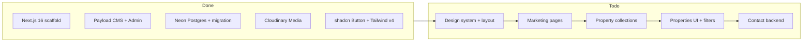

# Rajal Realty — Website Development Guide

The single source of truth for building the Rajal Realty / RealtyReach website. This guide merges product requirements, legacy content, the finalized design system, and a phased roadmap aligned with the current codebase.

**Related documentation:**

- [architecture.md](./architecture.md) — stack, env vars, deployment, Cloudinary integration
- [rebuild-content-guide.md](./rebuild-content-guide.md) — full verbatim copy for marketing pages
- [design_system.md](./design_system.md) — authoritative visual spec ("Modern Sanctuary")

---

## 1. Project Overview

| Field | Value |
|-------|-------|
| **Business** | Rajal Realty and Financial Services |
| **Product name** | RealtyReach |
| **Site title** | `RealtyReach - Rajal Realty` |
| **Location focus** | Ahmedabad, Gujarat, India |
| **Language** | English (`lang="en"`) |

**Objective:** Build a fast, SEO-optimized real estate discovery platform for a channel partner. Connect buyers with verified residential and commercial properties, managed through a headless CMS.

**Value proposition:** Clean Modern Sanctuary UI, Cloudinary-optimized images, RERA-verified listings, and friction-free lead generation via contact form, phone, and email — no third-party messaging integrations.

**Visual identity:** "Modern Sanctuary" — warm, editorial, high-end real estate aesthetic. See [design_system.md](./design_system.md). The legacy deep-blue palette from the old site is **not** used.

---

## 2. Current Project Status

### Done (Phase 0 — Infrastructure)

- Next.js 16 + React 19 App Router with route groups `(my-app)` / `(payload)`
- Payload CMS v3 at `/admin`, REST API at `/api/*`
- Neon PostgreSQL via `postgresAdapter` + initial migration (`src/migrations/20260625_080310_initial.ts`)
- Cloudinary storage for `Media` collection (`src/storage/cloudinaryAdapter.ts`)
- Tailwind CSS v4 + shadcn/ui (`Button` component, `cn` utility)
- Build pipeline runs `payload migrate` before `next build`

### Not started

- Public site is still the Next.js starter (`src/app/(my-app)/page.tsx`)
- No navbar, footer, or marketing pages
- No Modern Sanctuary tokens in `globals.css` (default shadcn neutrals)
- No property collections beyond `Users` and `Media`
- No Lora / DM Sans fonts loaded



---

## 3. Information Architecture

| Route | Purpose | Content source |
|-------|---------|----------------|
| `/` | Landing — hero, services, investments, featured properties, CTA | [rebuild-content-guide §3](./rebuild-content-guide.md) |
| `/about` | Company story & mission | [rebuild-content-guide §4](./rebuild-content-guide.md) |
| `/contact` | Inquiry form + contact details | [rebuild-content-guide §5](./rebuild-content-guide.md) |
| `/properties` | Searchable listing grid + filters | This doc §5 |
| `/property/[slug]` | Detail — gallery, pricing matrix, amenities | This doc §5 |

**Global layout** (every page):

1. Sticky Navbar — 4 links + logo (`/logo.svg`, alt: `Rajal Realty Logo`)
2. Page content
3. Footer — copyright + tagline
4. Toast notifications (contact form submit)

**Navbar links:**

| Label | Path | Icon |
|-------|------|------|
| Home | `/` | Home |
| Properties | `/properties` | Building |
| About Us | `/about` | Info |
| Contact Us | `/contact` | Mail |

---

## 4. Page Content Specification

Full verbatim copy lives in [rebuild-content-guide.md](./rebuild-content-guide.md). Key content summarized below for quick reference during implementation.

### SEO metadata

- **Title:** `RealtyReach - Rajal Realty`
- **Description:** `Your trusted partner in property buying, selling, rentals, and unique real estate investments.`

### Home (`/`)

**Structure:** Navbar → Hero → Services → Investments → Featured Properties (Phase 4) → CTA → Footer

**Hero**

| Element | Content |
|---------|---------|
| H1 | Rajal Realty: Your Partner in Property & Investment |
| Subheadline | Navigating the world of real estate with expertise. We specialize in buying, selling, rentals, and unique investment opportunities tailored for you. |
| Primary CTA | Explore Properties & Investments → `/properties` |
| Background alt | Modern architecture background |

**Services** — H2: *Our Core Real Estate Services*

| Title | Description | Icon |
|-------|-------------|------|
| Property Buying | Find your dream home or ideal investment property with our expert guidance and extensive listings. | Home |
| Property Selling | Maximize your property's value and reach the right buyers through our strategic marketing and negotiation skills. | Tag |
| Property Rentals | Secure reliable tenants or find the perfect rental property with our comprehensive management and screening services. | KeyRound |

**Investments** — H2: *Explore Unique Investment Opportunities*

| Title | Description | Icon |
|-------|-------------|------|
| Buyback Deals | Secure investments with guaranteed returns through our exclusive property buyback agreements. | TrendingUp |
| Pre-Lease Properties | Invest in commercial properties with tenants already secured, ensuring immediate rental income. | Building2 |
| Plotting | Acquire strategically located land parcels with high appreciation potential for future development. | Map |
| Weekend Villas | Own a luxurious getaway home perfect for relaxation or generating rental income. | Palmtree |
| Pre-Launch Projects | Gain early access to promising new developments at preferential rates before public launch. | Rocket |

**CTA section**

| Element | Content |
|---------|---------|
| H2 | Ready to Find Your Perfect Property or Investment? |
| Body | Let Rajal Realty guide you through every step. Contact us today for a personalized consultation or explore our current listings. |
| Button 1 | Contact Us Now → `/contact` |
| Button 2 | View Properties → `/properties` |

### About (`/about`)

| Element | Content |
|---------|---------|
| H1 | About Rajal Realty |
| Subtitle | Your Partner in Real Estate and Finance |
| Welcome card title | Welcome to Rajal Realty and Financial Services |
| Welcome card subtitle | Your trusted partner in Ahmedabad for all your real estate and financial needs. |

**Paragraph 1:** Based in Ahmedabad, Rajal Realty specializes in helping you find your dream property, whether it's residential, commercial, or investment-focused. With deep roots in Ahmedabad's vibrant real estate market and strong relationships with local builders, we combine expertise, transparency, and commitment to deliver unmatched value and customer satisfaction.

**Paragraph 2:** On the financial services front, we offer tailored solutions in Ahmedabad to empower you with the resources and guidance needed to make sound financial decisions. From loans and investment planning to comprehensive advisory services, our team ensures your financial goals are met with ease and confidence.

**Our Mission:** Our mission is simple: to build lasting relationships by providing professional, personalized, and reliable services that exceed your expectations.

**Partner in Growth:** Let Rajal Realty and Financial Services be your partner in growth. Connect with us today to explore opportunities, make informed decisions, and secure your future!

### Contact (`/contact`)

| Element | Content |
|---------|---------|
| H1 | Contact Rajal Realty |
| Subtitle | We're here to help with all your real estate needs. |

**Form card:** Send Us a Message — *Fill out the form below, and we'll get back to you shortly.*

| Field | Label | Required | Validation | Placeholder |
|-------|-------|----------|------------|-------------|
| name | Full Name | Yes | Min 2 chars | John Doe |
| email | Email Address | Yes | Valid email | john.doe@example.com |
| phone | Phone Number (Optional) | No | — | +91 90999 04235 |
| subject | Subject | Yes | Min 5 chars | Inquiry about Property ID 123 |
| message | Your Message | Yes | Min 10, max 500 chars | Please provide details about your inquiry... |

**Submit states:** Default `Send Message` / Loading `Sending...`

**v1 behavior (simulated):** Client-side validation → 1.5s delay → toast: *Message Sent (Simulated)* / *We've received your inquiry and will be in touch soon.* Backend wiring is deferred to Phase 6.

**Direct contact:**

| Type | Value |
|------|-------|
| Email | [rajal.associate@gmail.com](mailto:rajal.associate@gmail.com) |
| Phone 1 | [+91 90999 04235](tel:+919099904235) |
| Phone 2 | [+91 94296 86726](tel:+919429686726) |
| Address | Shivranjani Society, Shivranjani Cross Road, Satellite, Ahmedabad |

### Footer (shared)

- **Copyright:** © {current year} Rajal Realty. All rights reserved.
- **Tagline:** Your Trusted Partner in Real Estate.

---

## 5. Property Features

### Search & discovery

- **Global search:** Keyword search for property names, builders, or localities
- **URL-driven filters:** Shareable search URLs via query params, e.g. `?type=apartment&bhk=3&budget=1cr&status=ready`
- **Filter dimensions:** Property type, BHK/configuration, budget brackets, status (under construction / ready to move), location

### Property presentation

- **Galleries:** Cloudinary-optimized sliders on detail pages (`next/image` + `res.cloudinary.com` remote pattern)
- **Configuration matrix:** Table of unit types (e.g. 2BHK vs 3BHK) with carpet areas and starting prices
- **Property cards** on `/properties`: thumbnail, name, location, starting price, BHK specs, RERA badge (Terracotta accent)

### Lead generation

- **Primary CTAs:** Contact Us (`/contact`), Call Now (`tel:+919099904235`)
- **Property detail:** "Inquire about this property" → `/contact?subject=Inquiry about [Property Name]`
- **Mobile sticky bar** on property detail: Call Now + Contact Us
- **Contact form v1:** Simulated submit (see §4 Contact)
- **Deferred (Phase 6):** Wire form to Payload `Inquiries` collection or email service (Resend/Nodemailer)

### All CTAs & links

| Source | Text | Destination |
|--------|------|-------------|
| Hero | Explore Properties & Investments | `/properties` |
| CTA section | Contact Us Now | `/contact` |
| CTA section | View Properties | `/properties` |
| Navbar | Home / Properties / About Us / Contact Us | respective routes |
| Navbar logo | (image) | `/` |
| Contact email | rajal.associate@gmail.com | `mailto:rajal.associate@gmail.com` |
| Contact phones | +91 90999 04235 / +91 94296 86726 | `tel:` links |

---

## 6. Design System — Modern Sanctuary

**Source of truth:** [design_system.md](./design_system.md)

The legacy colors in [rebuild-content-guide.md §1](./rebuild-content-guide.md) are **superseded**. Keep layout patterns from the rebuild guide; apply Sanctuary tokens for all visual styling.

### Color tokens

| Token | Hex | Role |
|-------|-----|------|
| `--background` | `#F9F8F6` Warm Alabaster | Page background |
| `--foreground` | `#2C302B` Deep Olive Black | Body text |
| `--card` | `#FFFFFF` | Card surfaces |
| `--primary` | `#5E7153` Sage Green | Primary buttons, navbar accents, CTA sections |
| `--secondary` | `#8E938B` Ash Green | Secondary UI, muted labels |
| `--accent` | `#C89F70` Muted Terracotta | RERA badges, trust signals, highlights |
| `--muted` / `--border` | Ash-green tints | Subtle backgrounds, dividers |
| `--radius` | `1rem` (16px) | Global soft-radius base |

### Typography

| Role | Font | Usage |
|------|------|-------|
| Display / headings | **Lora** (serif) | Hero H1, section H2s |
| Body & UI | **DM Sans** (sans) | Paragraphs, nav, forms, property data |

Load via `next/font/google` in `layout.tsx`; wire to `--font-heading` and `--font-sans` in `globals.css`.

### Component rules (shadcn/ui)

- **Cards:** `rounded-2xl` (16px), soft diffuse shadow (`shadow-soft` custom utility) — avoid heavy `shadow-lg`
- **Buttons:** `rounded-lg` (8px); primary = Sage Green; Terracotta for RERA/trust badges
- **Spacing:** `py-20` (80px) between major sections; `container mx-auto px-4`
- **Icons:** `lucide-react`

### Layout patterns

| Page | Header style |
|------|--------------|
| Home | Hero ~60vh (min 400px), Sage gradient overlay, optional bg image at 20% opacity |
| About, Contact | Primary-colored header bar (`py-6`, Lora H1 + DM Sans subtitle) |

**Inner page header:** `bg-primary text-primary-foreground`, title `text-3xl font-bold`, subtitle `text-primary-foreground/80`

**Mobile-first:** Large touch targets, swipe-friendly property galleries.

### Implementation

Replace default shadcn OKLCH neutrals in `src/app/(my-app)/globals.css` with Sanctuary tokens. The design doc uses HSL space-separated values — convert consistently for Tailwind v4 `@theme inline`. Add a `shadow-soft` utility for card elevation.

### RERA trust signal

Use `--accent` (Terracotta) **exclusively** for RERA-verified badges on property cards and detail pages.

---

## 7. Payload CMS Data Model

Extend `payload.config.ts` beyond current `Users` + `Media`:

| Collection | Key fields | Notes |
|------------|------------|-------|
| **Properties** | `title`, `slug`, `status`, `builder` (rel), `location` (rel), `category` (rel), `gallery` (media[]), `configurations[]` (bhk, carpetArea, price), `amenities` (rel[]), `features` (rich text), `reraNumber`, `featured` (bool) | Core listing |
| **Locations** | `city`, `neighborhood`, `pincode` | Filter taxonomy |
| **Categories** | `title`, `slug` | Residential, Commercial, etc. |
| **Builders** | `name`, `logo` (media), `description` | Developer spotlight |
| **Amenities** | `title`, `icon` (text or media) | Linked checklist |
| **Inquiries** *(deferred)* | `name`, `email`, `phone`, `subject`, `message`, `property` (rel, optional) | Phase 6 contact backend |

**Access control:** Properties and taxonomy collections — public read, auth-required write. Inquiries — create-only for public (future).

**After schema changes:** `pnpm run generate:types` → `pnpm run migrate:create -- <name>` → commit migration.

Marketing page copy stays **hardcoded in React components** for v1. Optional future `SiteSettings` global for contact phone/email.

---

## 8. Technical Notes

Detailed setup, env vars, and deployment: [architecture.md](./architecture.md)

Key points:

- Single-repo Next.js + Payload; public routes in `src/app/(my-app)/`, admin at `/admin`
- Fetch properties server-side via Payload Local API or REST (`/api/properties`) with RSC
- Cloudinary via `src/storage/cloudinaryAdapter.ts`; watch **4.5 MB** Vercel upload limit for property photos
- URL query params handle filter state for shareable search results

---

## 9. Development Phases

### Phase 0 — Infrastructure ✅ Complete

- Next.js + Payload + Neon + Cloudinary + migrations

### Phase 1 — Design system & layout shell

- Implement Modern Sanctuary tokens in `globals.css` per [design_system.md](./design_system.md)
- Load Lora + DM Sans via `next/font/google`; set `--font-heading` / `--font-sans`
- Customize shadcn `Button` and add `Card` with 16px radius + `shadow-soft`
- Build shared components: `Navbar`, `Footer`, `PageHeader`, `Section`
- Update root `layout.tsx` metadata (title, description, `lang="en"`)
- Add `/logo.svg` asset (color treatment to match Sage/Terracotta palette)

### Phase 2 — Marketing pages

- Rebuild `/` (hero, services, investments, CTA sections)
- Build `/about` and `/contact` with content from rebuild guide
- Contact form: validation + simulated submit + toast
- Verify content checklist (§10)

### Phase 3 — Property CMS

- Create collections: Properties, Locations, Categories, Builders, Amenities
- Run migration; generate types
- Seed 10–15 sample properties with Cloudinary images in admin

### Phase 4 — Property frontend

- `/properties` listing page with property cards + pagination
- `/property/[slug]` detail page: gallery, config matrix, amenities, inquiry CTA
- Featured properties section on home (`featured: true`, limit 3–6)
- Mobile sticky contact bar on detail page

### Phase 5 — Search & filtering

- URL-driven filters on `/properties` via `searchParams`
- Payload query building for type, BHK, budget, status, location
- Empty states and loading skeletons

### Phase 6 — Polish & production

- Wire contact form to `Inquiries` collection or email
- Property-context pre-fill on contact (`?subject=Inquiry about [Property]`)
- SEO: per-page metadata, Open Graph images
- Error monitoring, staging Neon branch
- Optional: Google Maps embed on contact page

---

## 10. Component Map

```
src/
├── app/(my-app)/
│   ├── layout.tsx          # Navbar + Footer wrapper
│   ├── page.tsx            # Home
│   ├── about/page.tsx
│   ├── contact/page.tsx
│   ├── properties/page.tsx
│   └── property/[slug]/page.tsx
├── components/
│   ├── layout/             # navbar, footer, page-header
│   ├── home/               # hero, services, investments, cta
│   ├── properties/         # card, filters, gallery, config-table
│   ├── contact/            # contact-form
│   └── ui/                 # shadcn primitives
├── collections/            # Payload schemas
└── lib/
    ├── payload.ts          # getPayload() helper
    └── queries/            # property filter builders
```

---

## 11. Content & Launch Checklist

### Marketing content

- [ ] Site title & meta description
- [ ] Navbar — 4 links + logo
- [ ] Home — hero headline, subheadline, CTA
- [ ] Home — 3 service cards (title + description each)
- [ ] Home — 5 investment cards (title + description each)
- [ ] Home — CTA section (heading, body, 2 buttons)
- [ ] About — page header, welcome card, mission card, partner in growth card
- [ ] Contact — page header, form (5 fields), email, 2 phones, address
- [ ] Footer — copyright + tagline

### Design system

- [ ] Color tokens match [design_system.md](./design_system.md)
- [ ] Lora + DM Sans loaded and applied
- [ ] Card radius 16px, button radius 8px, `shadow-soft` on cards
- [ ] RERA badges use Terracotta accent color
- [ ] Section spacing uses generous 80px rhythm

### Property features

- [ ] Featured properties on home
- [ ] Property card fields populated
- [ ] Filter taxonomy seeded (locations, categories)
- [ ] Contact phones/emails match rebuild guide
